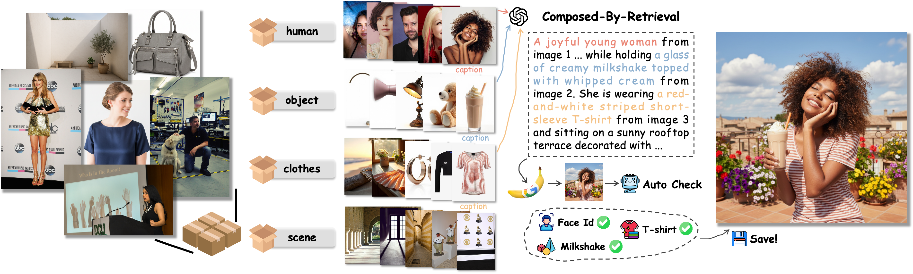
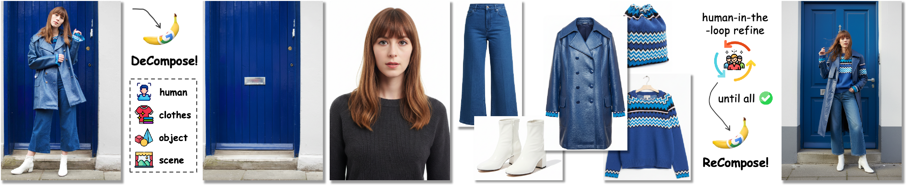
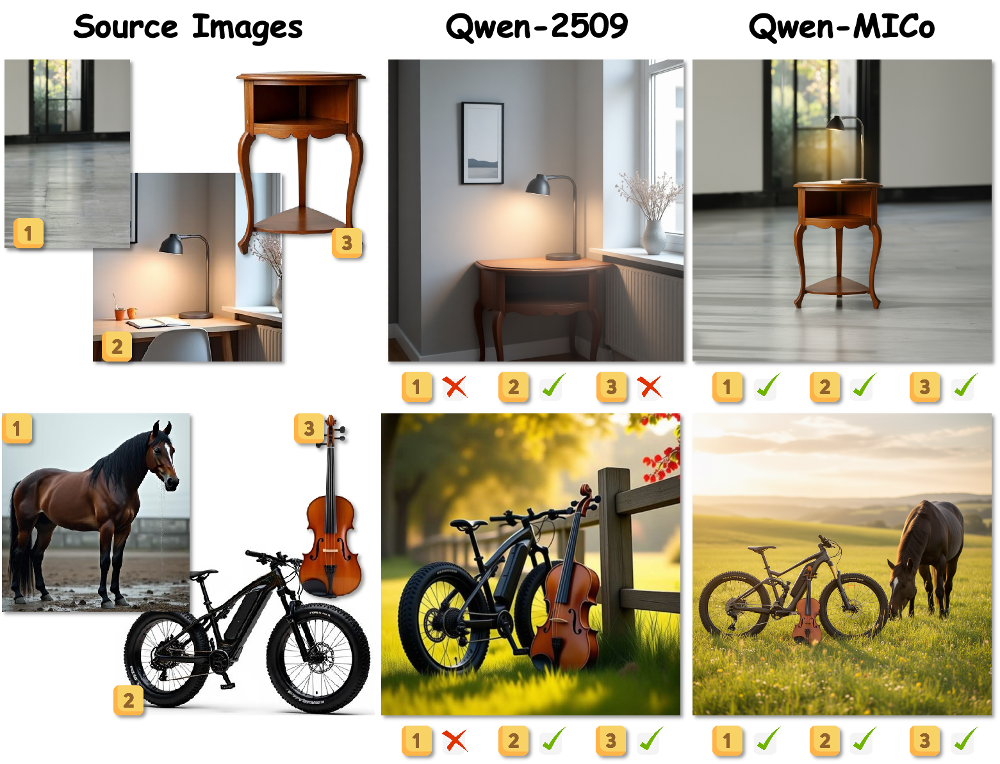
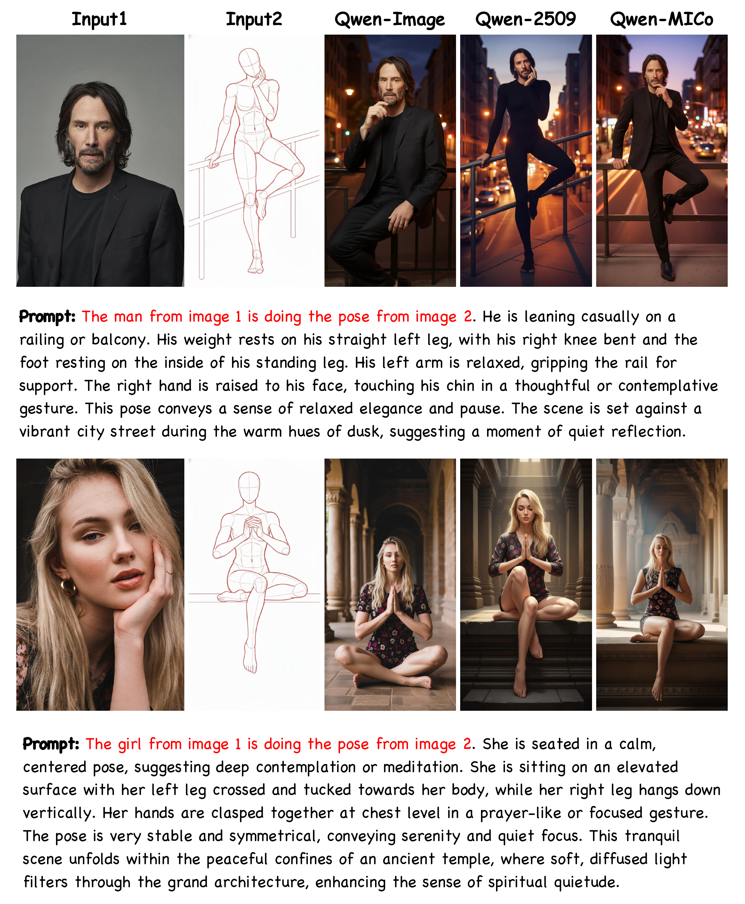
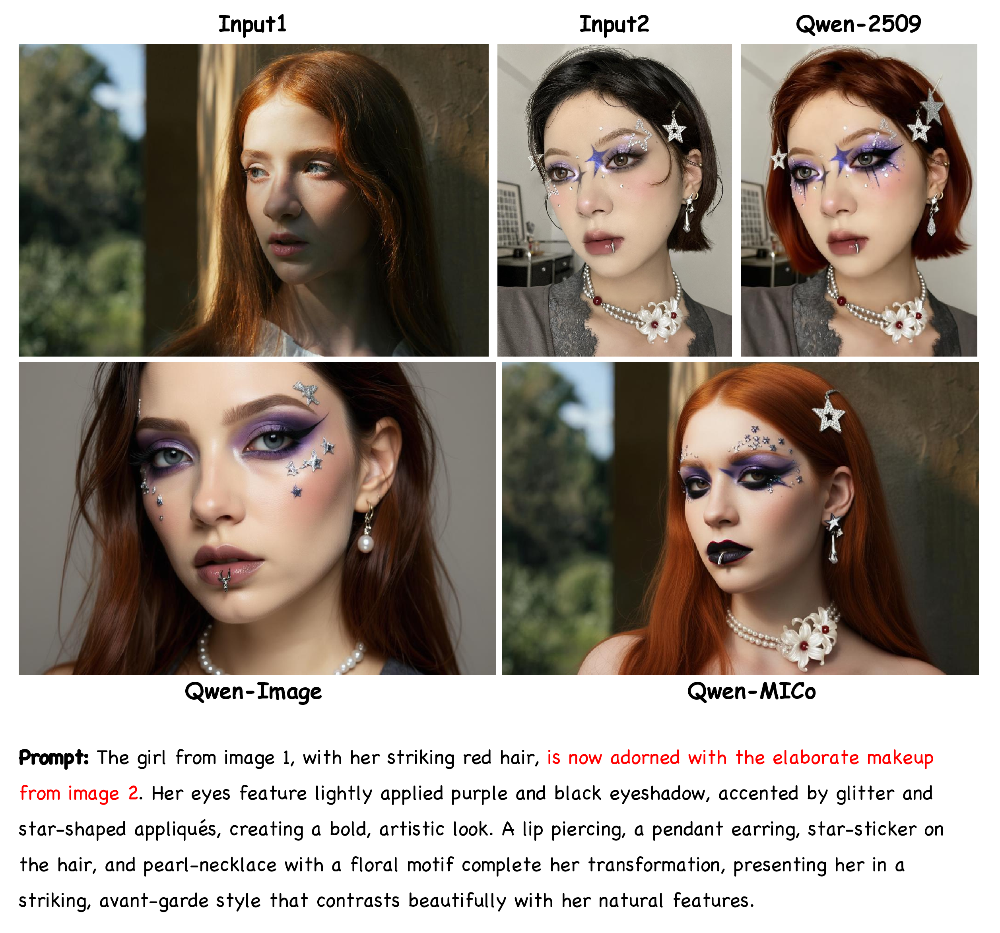
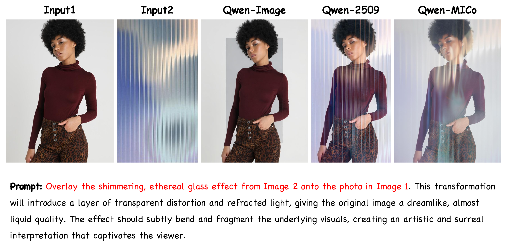
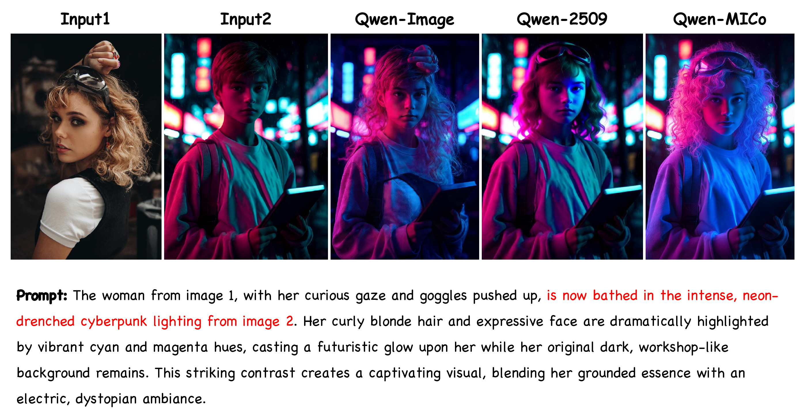
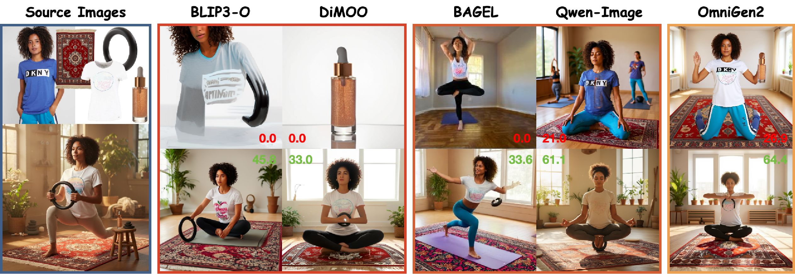

#  MICo-150K: A Comprehensive Dataset Advancing Multi-Image Composition

Official repository for the paper [MICo-150K: A Comprehensive Dataset for Multi-Image Composition](https://arxiv.org/abs/2512.07348).

## 📢 News

* **Apr 15, 2026**: 📊 Release **MICo-Bench** — 897 evaluation cases with Weighted-Ref-VIEScore evaluation script. See [`MICo-Bench/`](https://github.com/A113N-W3I/MICo-150K/tree/main/MICo-Bench).
* **Mar 1, 2026**: 🔥 Release Qwen-Image-MICo [checkpoint](https://huggingface.co/kr-cen/Qwen-Image-MICo) and [inference script](https://github.com/A113N-W3I/MICo-150K/blob/main/infer/infer_qwenimage.py).
* **Feb 21, 2026:** 🎉 MICo-150K has been accepted to **CVPR 2026**!
* **Feb 21, 2026:** 📦 We released the full **MICo-150K dataset** on Hugging Face: https://huggingface.co/datasets/kr-cen/MICo-150K.
* **Dec 16, 2025:** 🔥 We released official [gradio demo](https://huggingface.co/spaces/kr-cen/Qwen-Image-MICo) for Qwen-Image-MICo, try it out!
* **Dec 10, 2025:** 🚀 We released finetuned checkpoints [BAGEL-MICo](https://huggingface.co/kr-cen/BAGEL-MICo), [BLIP3o-Next-MICo](https://huggingface.co/kr-cen/BLIP3o-Next-MICo), [Lumina-DiMOO-MICo](https://huggingface.co/kr-cen/Lumina-DiMOO-MICo), and [OmniGen2-MICo](https://huggingface.co/kr-cen/OmniGen2-MICo), with impressive multi-image composition capability. ~~Our MICo-150K dataset coming soon, stay tuned! 👀~~
* **Dec 10, 2025:** 📖 We released multi-image composition [training](https://github.com/A113N-W3I/MICo-150K/blob/main/TRAIN.md) & [inference](https://github.com/A113N-W3I/MICo-150K/blob/main/INFER.md) guideline for community models. ~~Our finetuned checkpoints coming soon, stay tuned! 👀~~
* **Dec 9, 2025:** 🔥 Our paper on [arXiv](https://arxiv.org/abs/2512.07348).
* **Dec 2, 2025:** 🎬 We released the official [project page](https://mico-150k.github.io/) for MICo-150K.

## Introduction

* **We present MICo-150K**, a large-scale, high-quality dataset for **Multi-Image Composition (MICo)** in controllable image generation. MICo focuses on synthesizing coherent and identity-consistent images from multiple reference inputs—a long-standing challenge due to the lack of suitable training data.
* MICo-150K covers **7 representative MICo tasks**, constructed from carefully curated source images and diverse composition prompts. The dataset is synthesized using strong proprietary models and refined via **human-in-the-loop filtering**, ensuring high fidelity and identity consistency. We further introduce a **Decomposition-and-Recomposition (De&Re)** subset, where real-world complex images are decomposed into components and recomposed, supporting both real and synthetic compositions.
* To enable systematic evaluation, we release **MICo-Bench**, consisting of **1000 curated test cases**, and propose **Weighted-Ref-VIEScore**, a new metric tailored specifically for MICo. We also provide strong baselines, including **Qwen-MICo**, which demonstrates competitive performance with proprietary models while supporting arbitrary multi-image inputs.

## 🏗️ Data Construction Pipeline

### Composition Tasks (Object-Centric, Person-Centric, HOI)

We curate high-quality source images across four categories — **human**, **object**, **clothes**, and **scene** — from publicly licensed datasets, filtered and captioned by Qwen2.5-VL-72B. For each task, source images are sampled and combined using our **Compose-by-Retrieval** strategy: GPT-4o selects the most semantically compatible combination from candidate pools, then generates a natural composition prompt. The composite images are synthesized by Nano-Banana and verified via Qwen2.5-VL-72B (for objects/scenes) and ArcFace (for facial identity consistency).

### Decompose-and-Recompose (De&Re)

We collect high-quality single-person portraits from CC12M and use Nano-Banana to **decompose** each into its constituent components — person, clothing, objects, and scene. Human annotators inspect and refine all decomposed components. Once verified, Nano-Banana **recomposes** them into a complete image. Each set of components thus yields two versions: a real-world original and a synthesized recomposition.

## 🔥 Qwen-MICo

**Qwen-MICo** is our primary baseline, fine-tuned from Qwen-Image-Edit on MICo-150K. Despite being trained on orders of magnitude less data than Qwen-Image-2509, Qwen-MICo achieves competitive or superior performance:

- **Matches Qwen-Image-2509** on 3-image composition quality while **supporting arbitrary numbers of input images** (Qwen-Image-2509 is limited to 3).
- Produces images with **higher aesthetic quality** and stronger prompt adherence.
- Exhibits remarkable **emergent capabilities** including pose control, virtual makeup try-on, lighting transfer, and complex scene understanding — none of which were explicitly trained.

<b>Emergent Capabilities of Qwen-MICo (click to expand)</b>

<table><tr>
<td align="center"> <b>Pose Control</b></td>
<td align="center"> <b>Makeup Try-on</b></td>
<td align="center"> <b>Lighting & Optics</b></td>
<td align="center"> <b>Light Control</b></td>
<td align="center"> <b>Phone Wallpaper</b></td>
</tr></table>

We also fine-tune four other open-source models on MICo-150K, all showing substantial improvements. Models that originally lack MICo ability (BLIP3-o, Lumina-DiMOO) acquire strong composition capabilities from scratch; models with emergent MICo ability (BAGEL, OmniGen2) are further enhanced.

## 📑 Open-Source Plan

- [x] [MICo-150K dataset](https://huggingface.co/datasets/kr-cen/MICo-150K)
- [x] [MICo-Bench](https://github.com/A113N-W3I/MICo-150K/tree/main/MICo-Bench) (897 evaluation cases + Weighted-Ref-VIEScore evaluation script)
- [X] [Finetuned Checkpoints](https://huggingface.co/collections/kr-cen/mico-series)
- [X] [Training](https://github.com/A113N-W3I/MICo-150K/blob/main/TRAIN.md) and [Inference](https://github.com/A113N-W3I/MICo-150K/blob/main/INFER.md) Guidelines
- [X] [Gradio Demo](https://huggingface.co/spaces/kr-cen/Qwen-Image-MICo)
- [X] [Technical Report](https://arxiv.org/abs/2512.07348)

## 🧱 Download Finetuned Models

| Models       | Download Link   | Demo |
|------------|-----------------|----------|
| BAGEL-MICo      | 🤗 [Huggingface](https://huggingface.co/kr-cen/BAGEL-MICo)    | ---------- |
| BLIP3o-Next-MICo | 🤗 [Huggingface](https://huggingface.co/kr-cen/BLIP3o-Next-MICo)    | ---------- |
| Lumina-DiMOO-MICo | 🤗 [Huggingface](https://huggingface.co/kr-cen/Lumina-DiMOO-MICo)     | ---------- |
| OmniGen2-MICo     | 🤗 [Huggingface](https://huggingface.co/kr-cen/OmniGen2-MICo) | ---------- |
| Qwen-Image-MICo     | 🤗 [Huggingface](https://huggingface.co/kr-cen/Qwen-Image-MICo) | 🎮 [Demo](https://huggingface.co/spaces/kr-cen/Qwen-Image-MICo)  |

## Train

See [TRAIN.md](https://github.com/A113N-W3I/MICo-150K/blob/main/TRAIN.md) for details.

## Inference

See [INFER.md](https://github.com/A113N-W3I/MICo-150K/blob/main/INFER.md) for details.

## MICo-Bench

MICo-Bench is a comprehensive benchmark for evaluating Multi-Image Composition, containing **897 curated cases** across four tasks:

| Task | Cases | Description |
|---|---|---|
| Object-Centric | 138 | Object + object / object + scene compositions |
| Human-Centric | 168 | Person + person / person + scene compositions |
| HOI | 291 | Person + objects / clothes / combined |
| De&Re | 300 | Decompose real images and recompose |

We propose **Weighted-Ref-VIEScore** as the evaluation metric:

$$\text{Score} = W \times \text{SC} \times \text{PQ}$$

- **W**: Preservation score averaged over all source elements (graded ArcFace similarity for faces, binary VLM check for objects/clothes/scenes)
- **SC**: Semantic consistency scored by GPT-5.4 against a human-verified reference image
- **PQ**: Perceptual quality scored by GPT-5.4 on the generated image alone

The annotation files and evaluation script are in [`MICo-Bench/`](https://github.com/A113N-W3I/MICo-150K/tree/main/MICo-Bench). The benchmark images (source images and references) are hosted on Hugging Face: 🤗 [A113NW3I/MICo-Bench](https://huggingface.co/datasets/A113NW3I/MICo-Bench). See [`MICo-Bench/README.md`](https://github.com/A113N-W3I/MICo-150K/blob/main/MICo-Bench/README.md) for download instructions and the step-by-step evaluation guide.

## 🏆 Leaderboard

Please see our [project page](https://mico-150k.github.io/#leaderboard) for better visualization. Feel free to raise a pull request with the bench scoring of your model 🤗

| Model |Object Centric | Human Centric | HOI  | De&Re | Overall |
| ------|--------------- | ------------- | ---- | ----- | ------- |
| [Gemini-3-Pro-Image-Preview](https://ai.google.dev/gemini-api/docs/models/gemini-3-pro-image-preview) | 50.59 | 54.75 | 50.21 | 52.13 |51.76|
| [Gemini-3.1-Flash-Image-Preview](https://ai.google.dev/gemini-api/docs/models/gemini-3.1-flash-image-preview) | 52.20 | 52.02 | 52.50 | 50.34 |51.66|
| [GPT-Image-1.5](https://developers.openai.com/api/docs/models/gpt-image-1.5) | 56.66 | 46.16 | 52.35 | 48.46 |50.60|
| [Gemini-2.5-Flash-Image](https://ai.google.dev/gemini-api/docs/models/gemini-2.5-flash-image) | 48.01 | 41.79 | 49.64 | 49.44 | 47.83 |
| [Qwen-Image-MICo](https://huggingface.co/kr-cen/Qwen-Image-MICo) | 52.38 | 21.11 | 34.95 | 37.42 |35.86|
| [Bagel-MICo](https://huggingface.co/kr-cen/BAGEL-MICo) | 38.98 | 28.45 | 25.30 | 44.51 |34.41|
| [OmniGen2-MICo](https://huggingface.co/kr-cen/OmniGen2-MICo) | 46.26 | 22.85 | 32.18 | 36.82 |33.82|
| [OmniGen2](https://huggingface.co/OmniGen2/OmniGen2) | 44.24 | 21.96 | 27.44 | 36.35 |31.42|
| [Qwen-Image-2509](https://huggingface.co/Qwen/Qwen-Image-Edit-2509) | 39.77 | 20.23 | 19.95 | 29.92 |27.47|
| [BLIP3o-Next-MICo](https://huggingface.co/kr-cen/Lumina-DiMOO-MICo) | 40.31 | 11.41 | 24.97 | 26.23 |25.21|
| [Qwen-Image-Edit](https://huggingface.co/Qwen/Qwen-Image-Edit) | 39.42 | 17.86 | 19.96 | 27.11 |24.94|
| [Lumina-Dimoo-MICo](https://huggingface.co/kr-cen/Lumina-DiMOO-MICo) | 38.44 | 12.14 | 24.66 | 21.32 |23.32|

## 🌟 Citation

~~~
@article{wei2025mico,
  title={MICo-150K: A Comprehensive Dataset Advancing Multi-Image Composition},
  author={Wei, Xinyu and Cen, Kangrui and Wei, Hongyang and Guo, Zhen and Li, Bairui and Wang, Zeqing and Zhang, Jinrui and Zhang, Lei},
  journal={arXiv preprint arXiv:2512.07348},
  year={2025}
}
~~~

## 🙋‍♂️ Questions?

If you have any questions or suggestions, feel free to open an [issue](https://github.com/A113N-W3I/MICo-150K/issues) or start a [discussion](https://github.com/A113N-W3I/MICo-150K/discussions).
